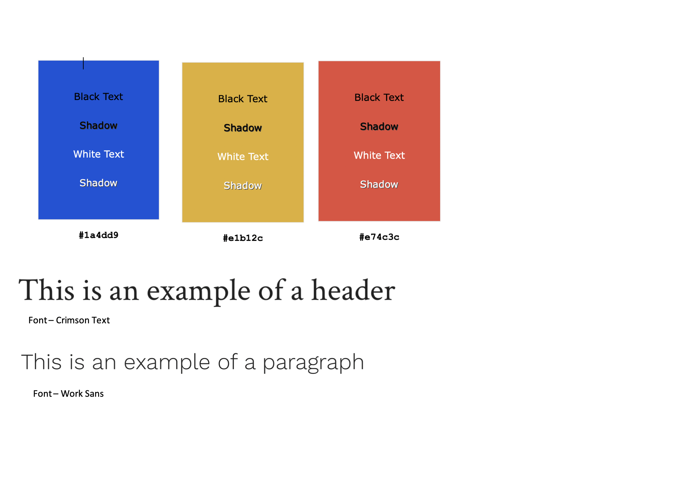
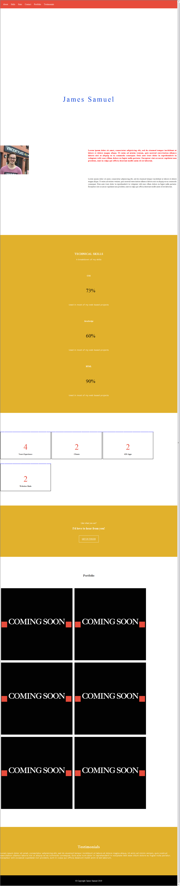
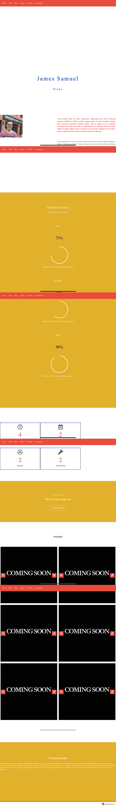
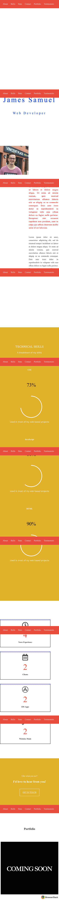

# Portfolio Website

## Description 
#### This website will help a university student who is aiming to work in the Web Design industry. This portfolio helps to showcase their current work and attract new clients.

## Website URL

https://dazzling-leakey-1c3004.netlify.com

## GitHub URL

https://github.com/jamesasam/Portfolio-Website

## Install

npm install

## Visual Style Guide

## HTML/CSS Style Guide

I will be following the W3Schools coding style guides

HTML Coding Style Guide:

https://www.w3schools.com/HTML/html5_syntax.asp

CSS Coding Style Guide:

https://google.github.io/styleguide/htmlcssguide.html#CSS

JavaScript Coding Style Guide:

https://www.w3schools.com/js/js_conventions.asp

## Branching Strategy

My code will be uploaded to the master branch which is linked to the Mac coding editor 'Atom' and also deployed to Netlify. Any updates are added to the master branch then pushed to GitHub/Netlify.

## Testing

Browsers Support

* Mozilla Firefox
* Microsoft Edge
* Opera
* Safari
* Google Chrome
* iOS Safari
* Chrome (Android)
* Firefox (Android)
* Samsung Internet

## Screenshots

### Desktop

### Tablet

### Mobile
Screenshots for mobile look poor because it is a continous sticking nav bar

## Reflection

I used a traditional two-column and three-column grid for this website as I didn't want to complicate the grid thus making the website too cluttered. I used Javascript, HTML and CSS to build this portfolio website and used W3Schools to build up any knowledge I didn't previously have. The contact form uses 'Mail-to' and opens up the user's mail app and opens a message to my personal email.

I have decided to use Netlify to host my website as this will automatically build the website using Yarn and uses the pushed changes from GitHub. 

I have used Node Packet Manager in this project which was built into Atom, it helps to maintain the dependecies in this project. A package.json is created which helps any development machine to know which dependencies are required by the portfolio website. 

### Problems Encountered

The main issue encountered was the grid system not working correctly but this was soon rectified by some research online as to how grids look on different viewports. 

## Conclusion

To conclude, this project was enjoyable and a good challenge. Using GitHub to manage work and push to Netlify for the first time was very rewarding and secure. Future steps for the website including filling it with content and making more pages.

## Author

James Samuel
* Twitter: https://twitter.com/JamesSamuelWeb1?s=20
* GitHub: https://github.com/jamesasam
* LinkedIn: https://www.linkedin.com/in/james-samuel-463913170/
